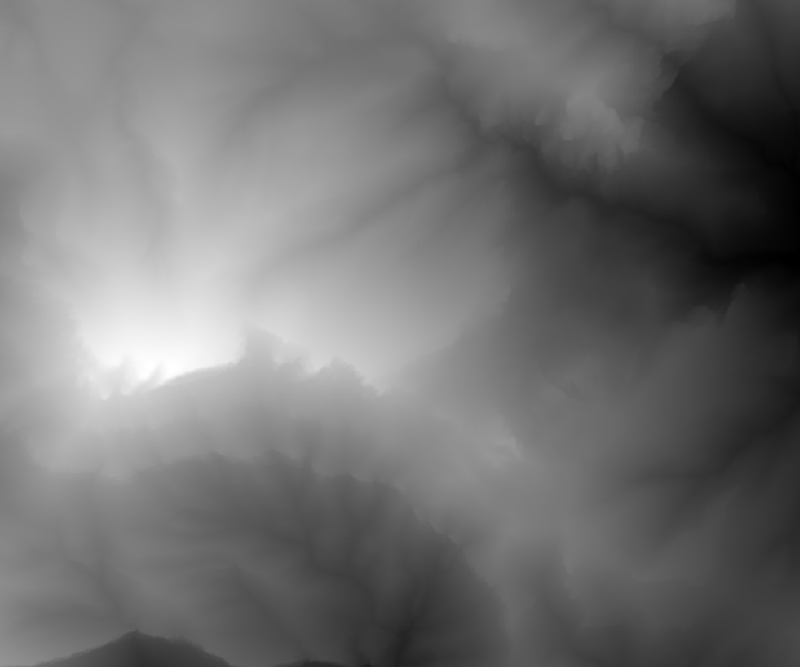

# ESRI DEM Cropper (java edition)
##Introduction 

This is a little program that allows you to cropp a subsection a  DEM (ESRI .asc) elevation map.

##Motivation

Usually when downloading elevation maps the selected surface is very big and you only need a small part of the map.  

From this: 

to this:

##Usage

Run from commandline

The output file will be written to a file next to the input file and its name will end in  "_Cropped.asc"
    
        java -jar ESRI_DEM_CROPPER dem_file xmin xmax ymin ymax
        

		dem_file = input file of the dem elevation map 
		
		xmin = new lowest x coordinate must be between 1 and xxmax - 1
		xmax = new highest x coordinate must be between xmin +1 and NCOLS (in the file header)

		ymin = new lowest y coordinate must be between 1 and yxmax - 1
		ymax = new highest y coordinate must be between ymin +1 and NROWS (in the file header)

